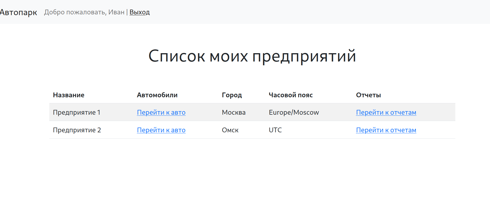
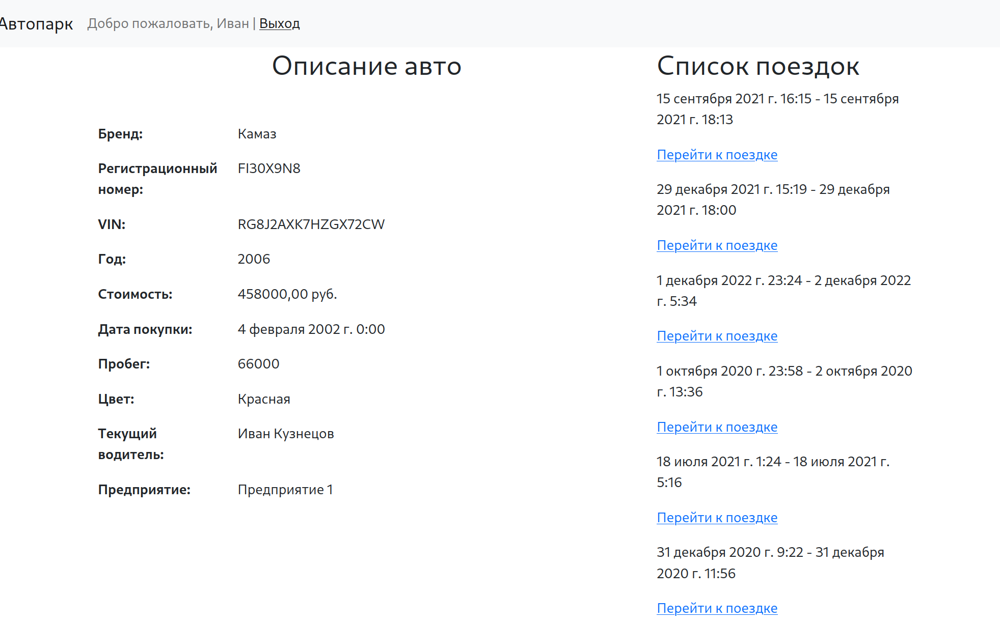
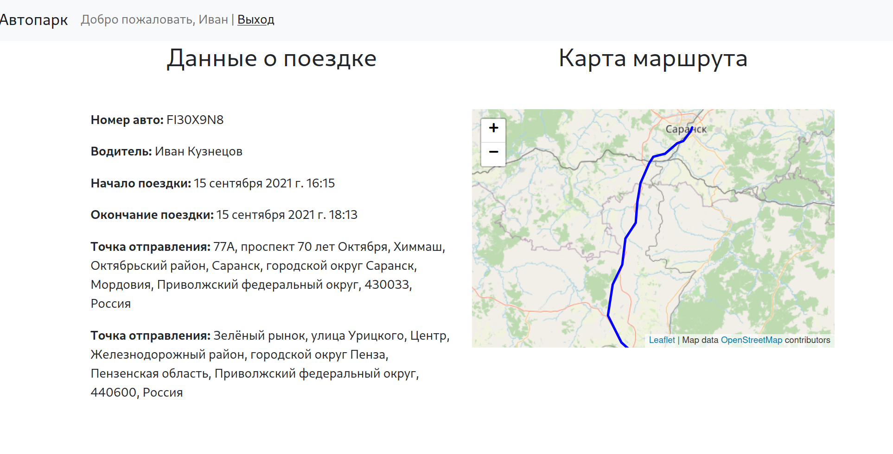
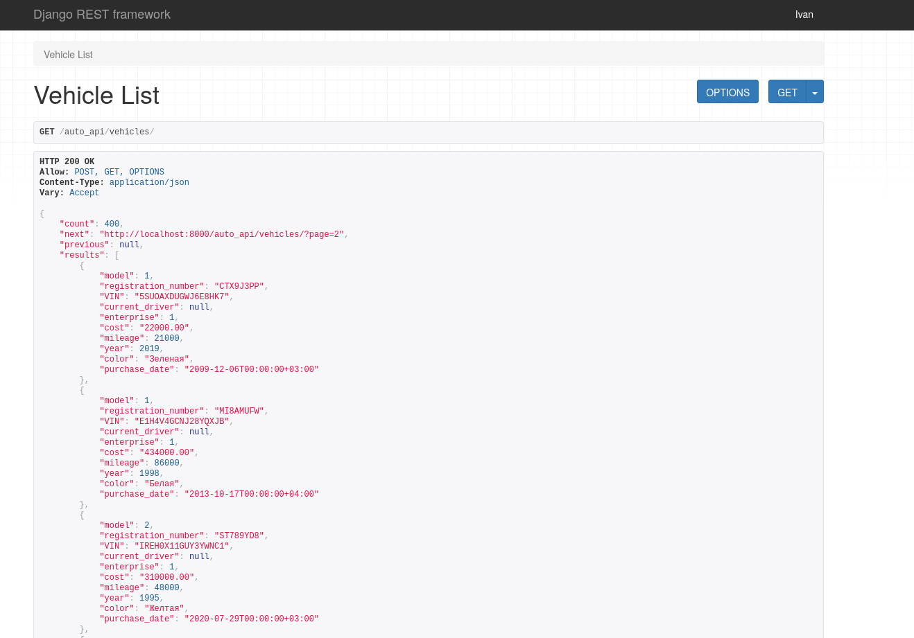

Управление автопарком на Django
============
Простое приложение для управления предприятиями автопарка. 




## Функционал

- Управление автомобилями, и водителями в рамках предприятия.



- Создание и настройка учетных прав для менеджеров предприятий.
- Возможность записи (в т.ч. в реальном времени) геоданных, содержащих информацию о длительности и протяженности поездок.
- Визуальная информация об автомобильных маршрутах.



- Аналитические отчеты по протяженности поездок по выбранному периоду.
- Возможность подключения телеграм-бота, предоставляющего аналитические сводки.
- API для всех указанных выше возможностей на основе `Django Rest Framework`.



## Ссылка на DockerHub

https://hub.docker.com/repository/docker/barabanovpv/django-autopark-example/general

## Запуск

```sh
# Запуск сервиса
docker compose up -d --build
```

В демо будут загружены тестовые данные из `autopark.json`.

## Обновление 2024-06-22

- Добавлено кэширование вью (файловое кэшерование в `settings.py`)
- Логирование запросов пользователей в файл `requests.log`
- Команды генерации авто могут работать асинхронно.
- Тествого добавлена реализация простого микросервиса для логирования действий менеджера с `confluent-kafka`
- Улучшена производительность запросов на вью с представлением авто [N+1 проблема](https://scoutapm.com/blog/django-and-the-n1-queries-problem)
- Добавлено интеграционное тестирование на `pytest-django`
- Добавлено тестирование **e2e** с [Cypress](https://www.cypress.io/)
- Автодокументация API на [Swagger](https://swagger.io/).
- Шаблон для `Nginx` сервера в папке nginx/

## Команды manage.py

Для использования команд генерации случайных геоданных при помощи [Openrouteservice](https://openrouteservice.org/), укажите свой токен в переменной окружения `OPENROUTESERVISE_API`.

```python
# Генерация автотрека с использованием Openrouteservice
$ python manage.py bettergeneratetrack enterprise_id --count

# Генерация автотрека с использованием Openrouteservice в реальном времени
$ python manage.py generatetrack enterprise_id --count

# Генерация случайных водителей
$ python manage.py generatedrivers enterprise_id --count

# Генерация случайных автомобилей
$ python manage.py generatevehicles enterprise_id --count

# Запуск телеграм-бота для получения отчетов
$ python manage.py starttelegrambot

```

---

## Команды для телеграм-бота

Для использования команд телеграм-бота, укажите свой токен в переменной окружения `TELEGRAM_TOKEN`.
```python
/login       # войти в систему под учетной записью менеджера
/make_report # создать отчет по пробегу автомобиля
/cancel      # отменить создание отчета
/see_report  # получить выгрузку по созданному отчету
```

---

## Установка демо

Склонируйте этот репозиторий и запустите `docker-compose up`.
Приложение установит необходимые образы и зависимости.
Демо содержит ограниченных набор данных для демонстрации.

Тестовые пользователи в демо:

- Admin:   пароль 1234
- Ivan:    пароль 8XRXF8PpgUr7tNj
- Vasiliy: пароль 8XRXF8PpgUr7tNj

---


## Лицензия

This project is licensed under the terms of the **MIT** license.
